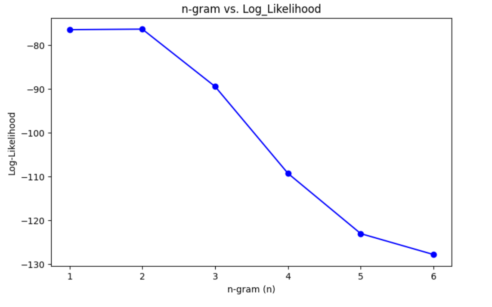
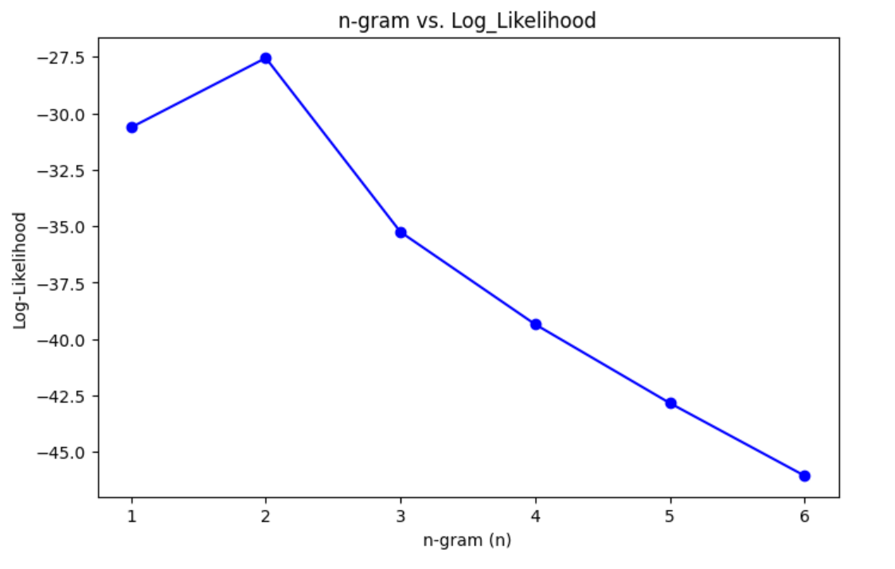

# lyric-agent
# Probabilistic model trained to generate song lyrics
# UC San Diego CSE150A Group Project, Milestone 3
# Eric Wang, Ryan Tang

## Dataset:
https://huggingface.co/datasets/sebastiandizon/genius-song-lyrics

## Abstract:
We propose a probabilistic model that is trained on song lyrics and generates new lyrics given user provided input keywords. This agent is utility-based rather than goal-based because rather than try to achieve a specific outcome, the generated song should maximize fluency/flow.

<!!!> TODO <!!!>
In addition to using log likelihood as a metric, we can employ a public tool like LanguageTool or NLTK to check how grammatically consistent our generated lyrics are. These criteria will be our performance measure; a song maximizes utility if it outputs coherent English and matches user provided keywords.

The environment of this agent is simply just the dataset of songs we provide it and the user provided prompts: this environment is fully observable. The actuator of this agent is its output lyrics. This agent’s sensor is the user’s keyboard, which will feed it keywords to generate the song from (like a genre, starting words, etc.). This agent’s actions are sequential because each word generated will depend on the previously generated words.

Training a probabilistic model would look something like this: given the previous words in the song, and the given keywords (like a given genre or topic), what is the next most likely word? As our model increases in complexity, we can incorporate song structure and create more and more coherent lyrics. We will be using different methods introduced in class to implement our agent, such as Naive Bayes, HMM, 


## PEAS:
*Performance Measure* \
Log Likelihood: How probable the generated lyrics are based on training data.

*Environment* \
Training Dataset: A corpus of song lyrics from Hugging Face.
User Input: Keywords, parameters, and starting words.
Fully Observable: The model has access to all necessary information to make decisions.

*Actuators*	\
Word-by-word lyric generation.

*Sensors* \
The AI agent takes in user inputs via a keyboard interface
Keywords, Parameters & Starting Words: Provided by the user.
Sequential Dependence: Each word prediction depends on previously generated words, as well as a hidden state that represents the structure of the song.

In Milestone 2, we used an n-gram model to generate words. This model uses CPTs generated from tokenized lyrics, trying to maximize P(next token | last n tokens). 

For this Milestone 3, we implemented a modified Hidden Markov Model. This model uses hidden states as song structure labels (Verse, Chorus, Bridge) and words ("beautiful", "dance") as observations.

In a standard HMM, the Markov assumption states that the next hidden state only depends on the previous hidden state, not any states before:

P(St|S0, S1, S2... St-1) = P(St|St-1)

Our HMM model combines this structure with our n-gram model from Milestone2: Instead of being dependent on only the previous hidden state, each state depends on the past n-1 states, and each observation depends on the past n-1 observations (as well as the current hidden state).

<!!!> Insert picture

This keeps the same functionality as our previous model, but should give our lyrics some underlying structure through the hidden states.

[The notebook where all of our data was cleaned, models were trained, and over/underfitting was calculated is here](hmm_ngram.ipynb)

## Dataset and preprocessing:
In the dataset we chose, each row contains information on a single song - it's lyrics, artist, genre, language, features, etc. For the purposes of this first model, most of these columns are irrelevant. We are mainly concerned with the lyrics and the "tag" column, which contains the genre (rap, pop) of the song. Before we calculated CPTs, we filtered songs by "language," and kept only songs in English. After performing this filter, we had *3,374,198* rows in our dataset.

<!!!> Add the picture

The cleaned datasets are way too big to upload into the repository, but we include a sample .csv of 100 songs after preprocessing and before tokenization [here](genius_lyrics_small.csv). This .csv wasn't used in training, and is just an example of the cleaning we did on the much larger dataset.

Like before, lyrics were tokenized by splitting the lyrics, including punctuation, and then trained. We applied laplace smoothing to avoid 0 probability n-grams, which was necessary to get meaningful log-likliehoods in the next step. But instead of just storing word counts, we paired each word with it's corresponding song structure label. In the provided genius lyric dataset, labels precede each part of the song.

[Verse 1]
Clock strikes upon the hour
And the sun begins to fade
Still enough time to figure out
How to chase my blues away

[Pre-Chorus]
I've done alright up 'til now
It's the light of day that shows me how
And when the night falls
The loneliness calls

During tokenization, when we detect a song structure label (e.g. [Verse 1]), we pair all following words with this label [(Clock, Verse 1), (strikes, Verse 1), ...] until we hit the next one ([Pre-Chorus]).

Our modified HMM has transition probabilities calculated by:

<!!!> Format better
Current label | Previous n-1 labels

and emission probabilities calculated by:

Current word | current label, previous n-1 words.

This probablities were calculated with (joint count / prior count)

## Training
The HMM algorithms were mostly implemented as described in class, with a few modifications.

<!!!> link to notebook snippet

Our 

## Evaluating
To evaluate, we used log likelihood, like in Milestone 2, even though we are aware it has a few flaws. Below is a heatmap 

<!!!> Insert heatmap

```
ll = 0.0
    ngram = deque([self.START_TOKEN] * (self.n - 1))
    for word in sentence:
      ngram.append(word)
      ngram_prob = self.get_ngram_probability(ngram)
      ll += -np.inf if ngram_prob == 0 else np.log(ngram_prob)
      ngram.popleft()
    return ll
```
To get our n-gram probabilities, we used the likelihood formulas from class, specifically, the probability of the n-gram (nth word given prior) divided by the sum of all possible nths words given our prior. Additionally, later during our implementation, to avoid zero probability n-grams, we utilized laplace smoothing. 

```
 def get_ngram_probability(self, ngram):
    ngram = [self.UNK_TOKEN if token not in self.vocab else token for token in ngram]
    prior = str(ngram[:-1]) # prior should be ngram except last token
    prior_count = sum(self.count[prior][word] for word in self.count[prior].keys()) # count is in the form count[prior][nth word] -> get prior_counts by summing all count[prior][arbitrary word]
    # probability of ngram should be count(nth word | prior words) / count(prior words)
    return (self.count[prior][ngram[-1]] + 1) / (prior_count + len(self.vocab)) # apply laplace smoothing
```

As for evaluation, we fed specific test sequences to our n-gram models and calculated the log likelihood of those sequences. You will see the results below.


## Overfitting / Underfitting

Like before, we think lower values of n will underfit and the higher values of n will overfit. Lower values of n won't be enough to capture all the patterns in our dataset of songs. Higher values will create good training data, but will perform bad on test data because unseen song lyrics will be viewed as unlikely even if they capture general patterns

Ideally, to test for overfitting and underfitting, we'd train the model using different values of n (bigram, trigram, etc). The problem with this is that because the dataset is so huge, and since computation because more and more costly for higher values of n, it becomes unfeasible for us to train so many models. 

We randomly sampled 10,000 songs and tested models of n = [2, 3, 4, 5].

Here are some sample lyrics generated:

`n = 2, input = ['hi']`
hi, i know that i know that i know that i know that i know that

Here, we loop between "i know that," which is to be expected with a low n.

`n = 5, input = ['hi', ',', 'you', 'are']`
hi, you are of the lord 2x my god has made his favour, to be manifested upon

These lyrics are actually pretty coherent, and look like they come from a Christian song.

`n = 6, input = ['hi', ',', 'you', 'are', 'my']`
hi, you are my, beautiful mess baby you are my beautiful, beautiful mess baby you are my

These lyrics also start to repeat, but the lyrics at least form a coherent message.
In Milestone3, the main issue we had was that lyrics would repeat often. We hoped that adding song structure would mitigate.

Then, we used sample lyrics from hit pop songs and calculated the negative log likelihood of each set of lyrics.

Below is the results of our different n-gram models on the lyrics `['now', 'and', 'then', ',', 'i', 'think', 'of', 'all', 'the', 'times', 'you', 'screwed', 'me', 'over']` from Gotye's "Somebody That I Used To Know"


Here are the results of our different n-gram models on a simpler test sequence `['i', 'wanna', 'dance', 'with', 'somebody']` from Whitney Houston's "I Wanna Dance With Somebody"


In general, we found that values of smaller n had the best log-likelihoods (closest to 0). In particular, it seems like our bigram model performed the best on those specific lyrics. As n increased, our log likelihood became further away from 0, indicating signs of overfitting since we were performing worse on the "test" data. Given our model, this makes sense, however this doesn't necessarily mean that lower n-grams are the best for our purpose of generating lyrics. Log-likelihood might not be the best metric for evaluating overfitting and underfitting, and we might need to experiment and research more complex methods, like perplexity. However, given the nature of n-gram, it is likely that we underfit on the lower values of n given that not much context is retained with lower values of n, however, as n gets larger, our model overfits since it is trained on relatively long specific sequences of words.

## Conclusion section
This model has noticeable improvements compared to our first model. While the model is still prone to running into cycles, the added hidden state makes it a little harder for it to be stuck into loops. Even so, like before, choruses and repetitive parts of song lyrics will inflate the probabilities in the CPT table, making it harder to generate interesting and unique lyrics. Additionally, for our n-gram, given the efficiency of the models relative to our large dataset, instead of taking all the n-grams over the whole dataset, we only took a random sample. Had we trained on the full dataset, higher n-grams could have performed better seeing more sequences. Furthermore, we could have varied our vocab sizes, leading to more unique n-grams that could change the log likelihoods calculated by our models. Unless we do specific things to mitigate loops, we suspect that it will always be an issue in any n-gram model. One consequence of having n-grams for the observations is that it makes it very unlikely for the hidden state to change, which makes loops more likely.

write about the pros and cons of likelihood, why we got our results

Future iterations of this model should first address the issue of loops: we could give increasing penalities to repeated hidden states: over time, it becomes more and more likely for the label to switch. Right now, our lyric generation is purely greedy, but if we wanted to get more varied lyrics we could consider adding some noise or randomness - this would further help mitigate loops.

This model could also benefit from even more parameters and user freedom - we could give the user more control over the generated lyrics by allowing them to select specific artists or time periods to sample from.

# Generative AI:
We used ChatGPT to help us implement tricky functions and debug our code. It was particularly useful in the creation of the NGramHMM class, helping us with functions like Viterbis, and for suggesting Perplexity as an alternative evaluation metric to log-likelihood.

--

Dataset:
https://huggingface.co/datasets/sebastiandizon/genius-song-lyrics
