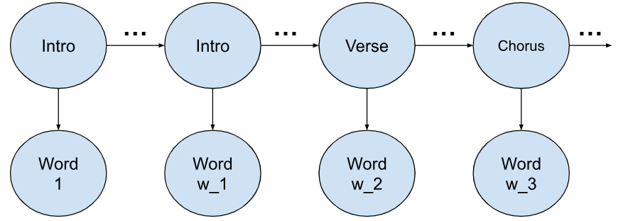
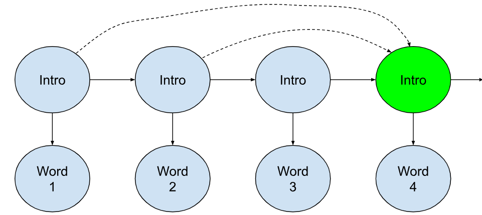
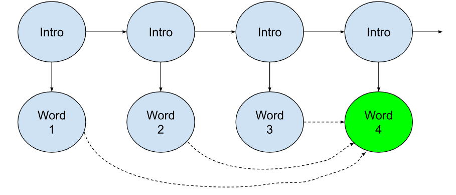
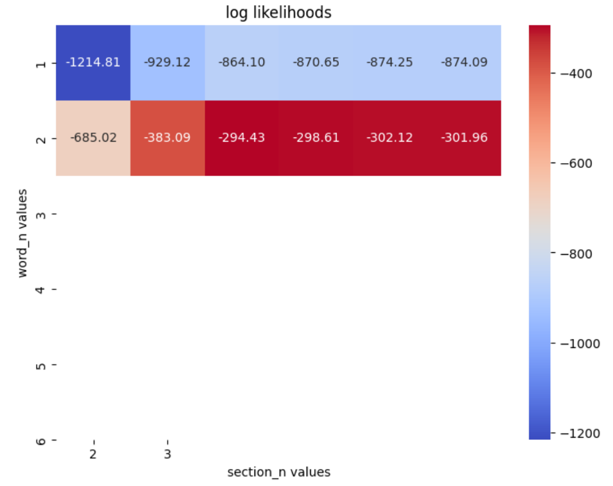
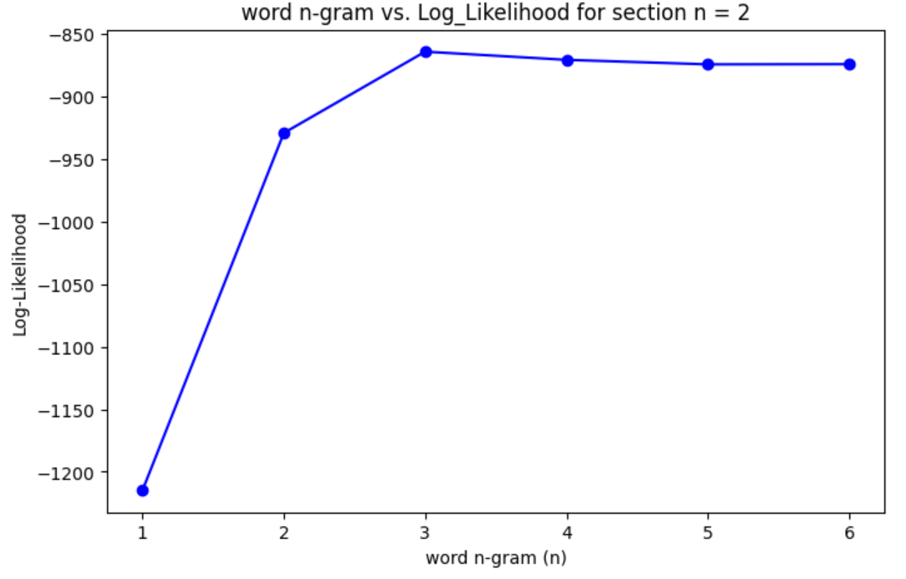
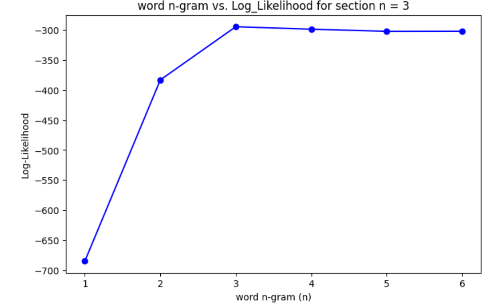

# lyric-agent
# Probabilistic model trained to generate song lyrics
# UC San Diego CSE150A Group Project, Milestone 3
# Eric Wang, Ryan Tang

## Dataset:
https://huggingface.co/datasets/sebastiandizon/genius-song-lyrics

## Abstract:
We propose a probabilistic model that is trained on song lyrics and generates new lyrics given user provided input keywords. This agent is utility-based rather than goal-based because rather than try to achieve a specific outcome, the generated song should maximize fluency/flow.

We are using likelihood as our metric because we seek to use the probabilities of our past lyrics to influence the next lyric to be generated. Additionally, as for evaluating how common some given lyrics may be for a certain tag or genre, we use log likelihood to demonstrate this. 

The environment of this agent is simply just the dataset of songs we provide it and the user provided prompts: this environment is fully observable. The actuator of this agent is its output lyrics. This agent’s sensor is the user’s keyboard, which will feed it keywords to generate the song from (like a genre, starting words, etc.). This agent’s actions are sequential because each word generated will depend on the previously generated words.

Training a probabilistic model would look something like this: given the previous words in the song, and the given keywords (like a given genre or topic), what is the next most likely word? As our model increases in complexity, we can incorporate song structure and create more and more coherent lyrics. We will be using different methods introduced in class to implement our agent, such as HMM.

## PEAS:
*Performance Measure* \
Log Likelihood: How probable the generated lyrics are based on training data.\

*Environment* \
Training Dataset: A corpus of song lyrics from Hugging Face.\
User Input: Keywords, parameters, and starting words.\
Fully Observable: The model has access to all necessary information to make decisions.\

*Actuators*	\
Word-by-word lyric generation.\

*Sensors* \
The AI agent takes in user inputs via a keyboard interface\
Keywords, Parameters & Starting Words: Provided by the user.\
Sequential Dependence: Each word prediction depends on previously generated words, as well as a hidden state that represents the structure of the song.\

## Agent/Model Setup
In Milestone 2, we used an n-gram model to generate words. This model uses CPTs generated from tokenized lyrics, trying to maximize $P(token_t | token_{t-1}, token_{t-2}, ..., token_{t-n+1})$. 

For this Milestone 3, we implemented a modified Hidden Markov Model. This model uses hidden states as song structure labels (Verse, Chorus, Bridge) and words ("beautiful", "dance") as observations.

In a standard HMM, the Markov assumption states that the next hidden state only depends on the previous hidden state, not any states before:

$P(S_t|S_0, S_1, S_2,... S_{t-1}) = P(S_t|S_{t-1})$

Our HMM model combines this structure with our n-gram model from Milestone2: Instead of being dependent on only the previous hidden state, each state depends on the past n-1 states, and each observation depends on the past n-1 observations (as well as the current hidden state).

Here is how an HMM model with the sections of the song as the hidden states and each word as an observation would look like.


In our modified HMM model, since our hidden states depend on the n-1 previous states, the relationship for our hidden state in green would look like the following.


Our other n-gram for our observations would follow the relationship below, where our observation shaded green not only depends on its corresponding hidden state but also the n-1 previous observations.


This keeps the same functionality as our previous model, but should give our lyrics some underlying structure through the hidden states. For example, in a rap song, certain words or phrases may be repeated over and over in a chorus or hook whereas a verse is much more diverse in wording. We aim to model this structure with our HMM implementation, keeping an n-gram for our words and hidden states to get more complex phrases, hopefully less repeat, and better transitions between song sections.

[The notebook where all of our data was cleaned, models were trained, and over/underfitting was calculated is here](hmm_ngram.ipynb)

## Dataset and preprocessing:
In the dataset we chose, each row contains information on a single song - it's `lyrics`, `artist`, `genre`, `language`, `features`, etc. For the purposes of this first model, most of these columns are irrelevant. We are mainly concerned with the lyrics and the "tag" column, which contains the genre (rap, pop) of the song. Before we calculated CPTs, we filtered songs by "language," and kept only songs in English. After performing this filter, we had *3,374,198* rows in our dataset.

The cleaned datasets are way too big to upload into the repository, but we include a sample .csv of 100 songs after preprocessing and before tokenization [here](genius_lyrics_small.csv). This .csv wasn't used in training, and is just an example of the cleaning we did on the much larger dataset.

Like before, lyrics were tokenized by splitting the lyrics, including punctuation, and then trained. Below, since we knew that each section label was indicated by an opening bracket [, we simply assigned each of our tokens to the current section, which was the word following the opening bracket [.

```
import re

def generate_tokens(batch):
    tokenized_lyrics = []
    for lyrics in batch["lyrics"]:
        tokens = re.findall(r"[\w']+|[.,!?;(){}\[\]]", lyrics) # tokenize by word and punctuation
        section = "N/A"
        sectioned_tokens = []  # stores (word, section) pairs

        for token_idx, token in enumerate(tokens):
            if token == "[":
                section = tokens[token_idx + 1]
            sectioned_tokens.append((token.lower(), section))
        tokenized_lyrics.append(sectioned_tokens)

    return {"lyric_tokens": tokenized_lyrics}

dataset = dataset.map(generate_tokens, batched=True, num_proc=num_cpus)
```

We applied laplace smoothing to avoid 0 probability n-grams, which was necessary to get meaningful log-likelihoods in the next step. But instead of just storing word counts, we paired each word with it's corresponding song structure label. In the provided genius lyric dataset, labels precede each part of the song.

[Verse 1]
Clock strikes upon the hour
And the sun begins to fade
Still enough time to figure out
How to chase my blues away

[Pre-Chorus]
I've done alright up 'til now
It's the light of day that shows me how
And when the night falls
The loneliness calls

During tokenization, when we detect a song structure label (e.g. [Verse 1]), we pair all following words with this label `[(Clock, Verse 1), (strikes, Verse 1), ...]` until we hit the next one `([Pre-Chorus])`.

## Training
The HMM algorithms were mostly implemented as described in class, with a few modifications. Namely, our transition and emission probabilties are calcualted differently given our n-gram structure for both our hidden states and observations. Our calculations for our transitions and emission probs are based on the idea $\frac{count_{joint}}{count_{prior}}$, which is how you would usually populate your probabilities in a standard n-gram model.

Our transition probabilities are calculated in `get_section_probs()` by:

$P(S_t | S_{t-1}, S_{t-2}, ..., S_{t-n_{section}+1}) = \frac{count(S_t, S_{t-1}, S_{t-2}, ..., S_{t-n_{section}+1})}{count(S_{t-1}, S_{t-2}, ..., S_{t-n_{section}+1})}$

and emission probabilities calculated in `get_word_probs()` by:

$P(O_t | S_t, O_{t-1}, O_{t-2}, ..., O_{t-n_{word}+1}) = \frac{count(O_t, S_t, O_{t-1}, O_{t-2}, ..., O_{t-n_{word}+1})}{count(O_{t-1}, O_{t-2}, ..., O_{t-n_{word}+1})}$

To represent our counts, we have dictionaries `word_ngram_counts` and `section_ngram_counts` as class members for our custom class to represent our HMM `NGramHMM`. In the code block below, you should get an idea of what each key is inside our dictionaries.

```
self.word_ngram_counts = defaultdict(lambda: defaultdict(lambda: defaultdict(int))) # word_ngram_counts[section][prev word_n - 1 words as list][word]
self.section_ngram_counts = defaultdict(lambda: defaultdict(int)) # section_ngram_counts[prev section_n - 1 sections][section]
```

Like in our previous model, for keys that required the memorization of n-1 tokens, we put these n-1 tokens into a `list` and then converted the `list` into a `string` to be used as the key. Since we have two different n-grams, we need two different n's. For our hidden state n-gram, we have `section_n` and for our observation n-gram, we have `word_n`.

In our training loop, `fit()`, we filtered our songs by user-given `tag` and chose the most `vocab_size` common words from the songs we had left to form our vocabulary. All words outside the vocabulary would then be interpretted as an `UNK_TOKEN` later when processing our n-grams.

As for populating our counts, like the last milestone, we used deques of size corresponding n - 1 to represent our two n-grams. As we iterated word by word in our relevant songs, we would add 1 to each of our counts, using our deques converted to `list` and then `string` and our current `section` and `token` as keys for our dictionaries. Then, we would update our n-gram deques by appending our current `token` or `section` and then popping the leftmost element, shifting our n-grams to the next word.
```
word_ngram = deque([self.START_TOKEN] * (self.word_n - 1))
section_ngram = deque([self.START_TOKEN] * (self.section_n - 1))
for _, song in tqdm(enumerate(songs_in_tag), total=len(songs_in_tag)):
    for token, section in song:
        self.word_ngram_counts[section][str(list(word_ngram))][token] += 1
        self.section_ngram_counts[str(list(section_ngram))][section] += 1
        word_ngram.append(token if token in self.vocab else self.UNK_TOKEN)
        section_ngram.append(section)
        word_ngram.popleft()
        section_ngram.popleft()
```
Now that we have our counts, we are able to calculate our transition and emissions probs to be used to calculate log-likelihood and to be used in song generation.

## Evaluating
Our evaluation metric is log likelihood. As mentioned way earlier, we use log likelihood to evaluate how probable a sequence of lyrics are. Additionally, it is convienent for us since we need to use likelihood of our n-grams to generate our new tokens and sections.

To calculate our log likelihood, since our model is an HMM, given a predetermined sequence of lyrics, we use the forward algorithm to calculate $P(lyrics)$ or $P(token_1, token_2, ..., token_{|lyrics|})$. 
```
def get_log_likelihood(self, lyrics):
```

To start off, our initial probabilities are calculated as the $P(section_{first}) = \frac{count(section_{first})}{|songs_{tag}|}$, which means the probability of a certain section being the first section is calculated by the number of times the section is first in a song in the tag over the number of songs in the tag.

```
first_section = ""
for token, section in song["lyric_tokens"]:
    if first_section == "":
        self.initial_probs[section] += 1
```
Above, we calculate $count(section_{first})$. Below, we calculate $P(section_{first})$ with the addition of laplace smoothing to deal with rare section labels that may appear first.
```
# handle initial probs
for section in self.states:
    self.initial_probs[section] = (self.initial_probs[section] + self.smoothing) / (len(songs_in_tag) + self.smoothing * len(songs_in_tag))
```
So, we have our initial probs, which allow us to calculate our initial $alpha$ in our forward algorithm. Just like in a standard forward algorithm using log likelihood, for each state, we populate the first time step with the sum of the log of the initial probs and the log of the emission probs.
```
for section_idx in range(self.S):
    alpha[0, section_idx] = np.log(self.initial_probs[self.states[section_idx]]) + np.log(self.get_word_probs(word_ngram, lyrics[0], self.states[section_idx]))
```
To reiterate, our emission probs is `get_word_probs`, which is calculated by the following. 
$P(O_t | S_t, O_{t-1}, O_{t-2}, ..., O_{t-n_{word}+1}) = \frac{count(O_t, S_t, O_{t-1}, O_{t-2}, ..., O_{t-n_{word}+1})}{count(O_{t-1}, O_{t-2}, ..., O_{t-n_{word}+1})}$
Using the counts we populated during training, we calculate our emission probs with the following.
```
# use for emissions
def get_word_probs(self, word_ngram, word, section):
    prior = str(list(word_ngram))
    prior_count = sum(sum(self.word_ngram_counts[sec][prior].values()) for sec in self.states) # marginalize over section since our prior should just be the prev n - 1 words
    return (self.word_ngram_counts[section][prior][word] + self.smoothing) / (prior_count + self.smoothing * self.T)
```
One interesting thing to notice is that we marginalize over the section since `word_ngram_counts` is a 3-dimensional dictionary, which requires two keys to actual get values that can be summed. Additionally, we use laplace smoothing to deal with rare words.

Now, we can get to the meat and potatoes of the forward algorithm. As usual, we iterate through each time step or in this case, lyric in our given lyrics. Then, we iterate through each of our current states, but instead of considering all of the previous states in a standard HMM, due to our hidden state n-gram, we use iterate over `itertools.product(range(self.S), repeat=self.section_n-1)`, which should give us all possible hidden state combinations of length `section_n-1` - simulating the possible previous states in our n-gram. We total up everything in log-space using our log emissions, log transitions, and previous `alpha`, updating our `alpha` at our current lyric step and state accordingly. Finally, we shift our word/observation n-gram.
```
# use forward algorithm to calculate the log likelihood of the given lyrics
for lyrics_idx in tqdm(range(1, L)):
    cur_word = lyrics[lyrics_idx]
    for cur_state_idx, cur_state in enumerate(self.states):
        log_obs = np.log(self.get_word_probs(word_ngram, cur_word, cur_state))
        tot = -np.inf
        for prev_states in itertools.product(range(self.S), repeat=self.section_n-1):
            prev_sections = [self.states[state] for state in prev_states]
            log_transition = self.get_section_probs(prev_sections, cur_state)
            tot = np.logaddexp(tot, log_transition + alpha[lyrics_idx - 1, prev_states[-1]])
        alpha[lyrics_idx, cur_state_idx] = tot + log_obs
    word_ngram.append(cur_word)
    word_ngram.popleft()
```
Our transition probs are calculated similar to our emission probs. Again, to reiterate, our transition probs are calculated in `get_section_probs()`, which essentially does the following calculation. 
$P(S_t | S_{t-1}, S_{t-2}, ..., S_{t-n_{section}+1}) = \frac{count(S_t, S_{t-1}, S_{t-2}, ..., S_{t-n_{section}+1})}{count(S_{t-1}, S_{t-2}, ..., S_{t-n_{section}+1})}$
Using our counts, below is an implementation of the above.
```
# use for transitions
def get_section_probs(self, section_ngram, section):
    prior = str(list(section_ngram))
    prior_count = sum(self.section_ngram_counts[prior].values())
    return (self.section_ngram_counts[prior][section] + self.smoothing) / (prior_count + self.smoothing * self.S) # apply laplace smoothing
```
Finally, we can calculate our log likelihood by summing over `alpha[L - 1]`, where L is the number of given lyrics. 

Using our `NgramHMM` model with `tag=pop`, `word_n=3`, `section_n=3`, we tried our model on the same cases as the previous model to evaluate.
```
# to evaluate our models, we will use lyrics from Gotye's "Somebody That I Used to Know"
test_lyrics = ['now', 'and', 'then', ',', 'i', 'think', 'of', 'all', 'the', 'times', 'you', 'screwed', 'me', 'over']
hmm_model.get_log_likelihood(test_lyrics)
```
On this example, we resulted in a log likelihood around -294, which means the sequence is decently probable given that it is 14 words long. 

```
# to evaluate our models, we will use lyrics from Whitney Houston's "I Wanna Dance With Somebody"
test_lyrics = ['i', 'wanna', 'dance', 'with', 'somebody']
hmm_model.get_log_likelihood(test_lyrics)
```
A shorter and more likely case is above with a log likelihood of around -188, which makes sense, however, the difference in log likelihood is not as high as anticipated given that the sequence is less than half the length of the previous. It could likely be a result of the shortened version of "want to" using "wanna" and just that the following sequence of words is not as common as we thought.

We then sought to evaluate the performance of our model with different parameters with `tag=pop` still with the parameters below.
```
section_n = [2, 3]
word_n = [1, 2, 3, 4, 5, 6]
```
We have provided a heatmap on the log likelihoods calculated by these different models on the first evaluation sequence we used above from Gotye's "Somebody That I Used to Know".


*NOTE: We just noticed our axes are labeled reverse, so the x-axis should actually be the y-axis and vice versa. Please don't dock points... Additionally, due to performance and efficiency concerns, we tried up to a bigram for our hidden state n-gram.*

Our heatmap suggests a combination of a hidden state bigram and higher order observation n-grams perform the best. Although comparing these models side to side by log likelihoods on the same sequence is not totally indicative of better performance, we can see that even as the observation n-gram increases in n, the log likelihood stagnates around the same value, indicating that the -290s to -300s range is the accurate mark.

## Overfitting / Underfitting

Like before, we think lower values of n will underfit and the higher values of n will overfit. Lower values of n won't be enough to capture all the patterns in our dataset of songs. Higher values will create good training data, but will perform bad on test data because unseen song lyrics will be viewed as unlikely even if they capture general patterns

We randomly sampled 10,000 songs and tested models of n = [2, 3, 4, 5].

Here are some sample lyrics generated:
Each model is given a tag (genre), the number of previous words to consider, and previous hidden states to consider.
When we generate lyrics, we provide a list of starting words and a starting section.

`tag='rap', word_n = 3, section_n = 3, starter=["[", "Intro", "]", "I", "see", "dead", "people"], start_section="Intro"`
Generated Lyrics:
[ Intro ] I see dead people , you know i got a lot of shit , i don't know what i'm gon' do , all they gotta do , all they gotta do , all they

Section Sequence:
['Intro', 'Intro', 'Intro', 'Intro', 'Intro', 'Intro', 'Intro', 'Verse', 'Verse', 'Verse', 'Verse', 'Verse', 'Verse', 'Verse', 'Verse', 'Verse', 'Chorus', 'Verse', 'Verse', 'Verse', 'Verse', 'Chorus', 'Chorus', 'Chorus', 'Chorus', 'Chorus', 'Chorus', 'Chorus', 'Chorus', 'Chorus', 'Chorus', 'Chorus', 'Chorus', 'Chorus', 'Chorus', 'Chorus', 'Chorus']

`tag='rap', word_n = 4, section_n = 2, starter=['hi', ',', 'you', 'are'], start_section="Verse"`
Generated Lyrics:
hi , you are all in my mind , but i don't believe in that shit and then turn it up , fuck it up , fuck it up , fuck it up ,

Section Sequence:
['Verse', 'Verse', 'Verse', 'Verse', 'Verse', 'Hook', 'Hook', 'Verse', 'Verse', 'Chorus', 'Chorus', 'Hook', 'Hook', 'Hook', 'Hook', 'Hook', 'Hook', 'Verse', 'Verse', 'Verse', 'Verse', 'Hook', 'Chorus', 'Chorus', 'Chorus', 'Chorus', 'Chorus', 'Chorus', 'Chorus', 'Chorus', 'Chorus', 'Chorus', 'Chorus', 'Chorus']

`tag='country', word_n = 3, section_n = 2, starter=['dance','with'], start_section="Chorus"`
Generated Lyrics:
dance with you but one day , you're something else i'm all out of the night funny i remember i the the the the the the the the the the the the

Section Sequence:
['Chorus', 'Chorus', 'Chorus', 'Chorus', 'Chorus', 'Chorus', 'Chorus', 'Chorus', 'Chorus', 'Chorus', 'Chorus', 'Chorus', 'Chorus', 'Chorus', 'Verse', 'Chorus', 'Chorus', 'Chorus', 'Chorus', 'Chorus', 'Verse', 'Verse', 'Verse', 'Verse', 'Verse', 'Verse', 'Verse', 'Verse', 'Verse', 'Verse', 'Verse', 'Verse']

The model performed with varying success, but almost always eventually got caught in a loop. Once it hits a loop, like when the first example repeats "all they gotta do , " over and over, it can't escape. It also seems that the song sections flow like they would in a normal song, though they switch at a much faster pace - first example, it starts in the Intro, transitiosn to a Verse, and then ends in a Chorus, which is not unlike the structure of real songs.

Below is the results of our different n-gram models on the lyrics `['now', 'and', 'then', ',', 'i', 'think', 'of', 'all', 'the', 'times', 'you', 'screwed', 'me', 'over']` from Gotye's "Somebody That I Used To Know".

For section_n = 2 (Each hidden state considers the previous 2 hidden states)


For section_n = 3 (Each hidden state considers the previous 3 hidden states)


We see that log likelihood increases until n=3, and then stays at around the same level. It's hard to say from the graphs, but it looks like the log likelihood slowly decreases as n gets bigger: for very large values of n, this model might be overfit, but models of large n would be too costly for us to reasonably run. We're not sure why the likelihood decreases so slowly - we suspect one possible reason this could happen is because n-grams for high n are so rare that laplace smoothing might account for the fact that most n-grams don't exist in the corpus.

## Conclusion section
This model has noticeable improvements compared to our first model. While the model is still prone to running into cycles, the added hidden state makes it a little harder for it to be stuck into loops. Even so, like before, choruses and repetitive parts of song lyrics will inflate the probabilities in the CPT table, making it harder to generate interesting and unique lyrics. Additionally, for our n-gram, given the efficiency of the models relative to our large dataset, instead of taking all the n-grams over the whole dataset, we only took a random sample. Had we trained on the full dataset, higher n-grams could have performed better seeing more sequences. Furthermore, we could have varied our vocab sizes, leading to more unique n-grams that could change the log likelihoods calculated by our models. Unless we do specific things to mitigate loops, we suspect that it will always be an issue in any n-gram model. One consequence of having n-grams for the observations is that it makes it very unlikely for the hidden state to change, which makes loops more likely.

Future iterations of this model should first address the issue of loops: we could give increasing penalities to repeated hidden states: over time, it becomes more and more likely for the label to switch. Right now, our lyric generation is purely greedy, but if we wanted to get more varied lyrics we could consider adding some noise or randomness - this would further help mitigate loops.

This model could also benefit from even more parameters and user freedom - we could give the user more control over the generated lyrics by allowing them to select specific artists or time periods to sample from.

# Generative AI:
We used ChatGPT to help us implement tricky functions and debug our code. It was particularly useful in the creation of the NGramHMM class, helping us with functions like Viterbis, and for suggesting Perplexity as an alternative evaluation metric to log-likelihood.

--

Dataset:
https://huggingface.co/datasets/sebastiandizon/genius-song-lyrics
